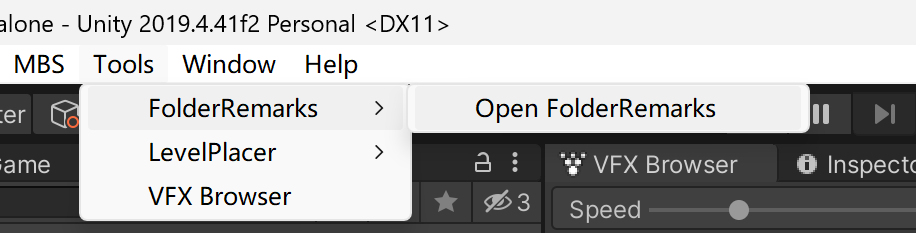
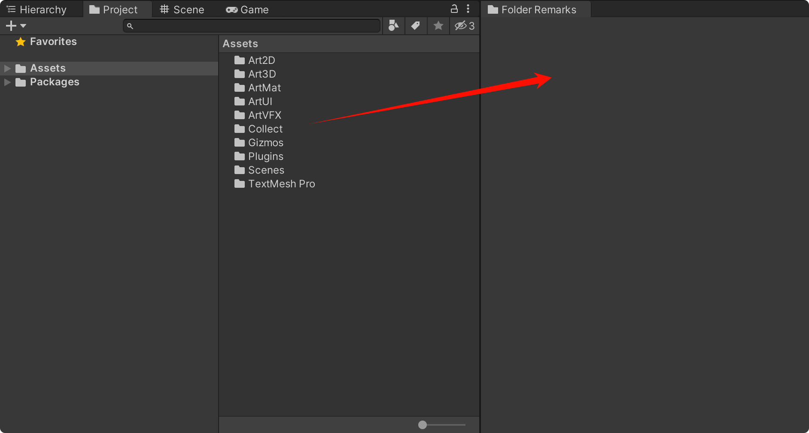
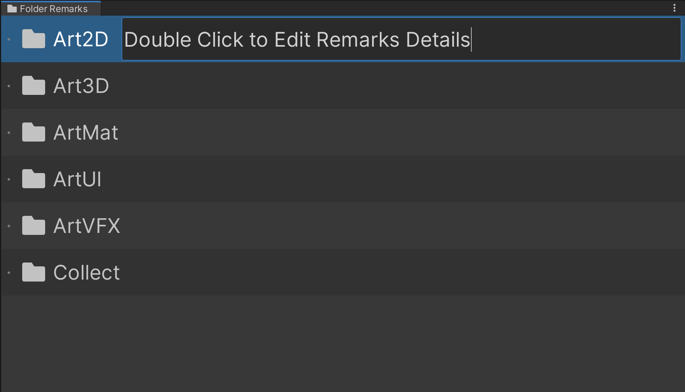
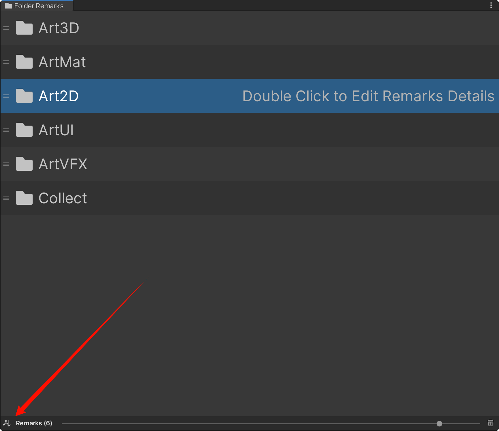
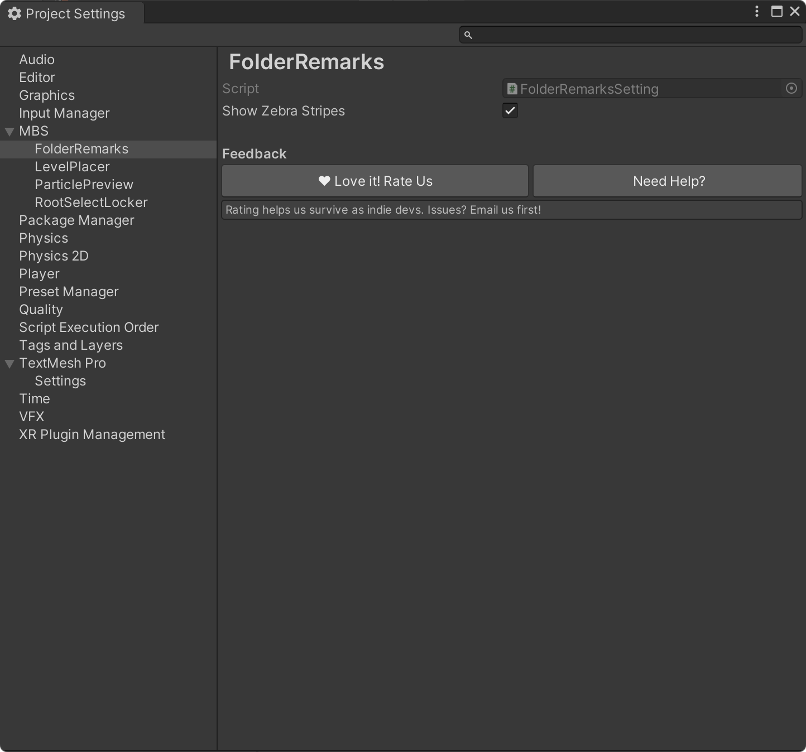

# Folder Remarks

Quick-start manual

This is a short manual that helps you to get started with **Folder Remarks**. 

If you have any bug reports or suggestions - [FcsVorfeed@mbs-studio.com](mailto:FcsVorfeed@mbs-studio.com)

Resource Store Connection - https://assetstore.unity.com/packages/slug/355838

# **Open Folder Remarks Window**

**Tools -> Folder Remarks -> Open FolderRemarks**

	

# **Add Folder**

**Simply drag the folder onto the Folder Remarks window, that's all.**

# Edit Remark Details

**You can edit the remarks by double-clicking the target row.**

# Toggle Sorting

**Click the small icon in the bottom left corner to switch between three sorting modes:**

- Name (Ascending)

- Name (Descending)

- Custom Sort

# **Settings Interface**

You can find the detailed settings page by going to 

**Edit -> ProjectSettings -> MBS -> FolderRemarks.**

