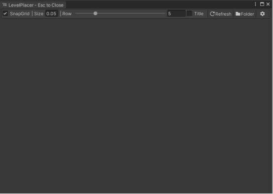
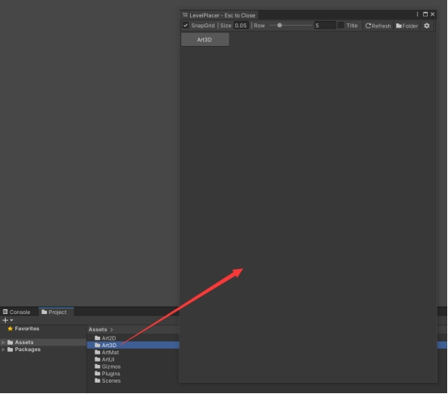
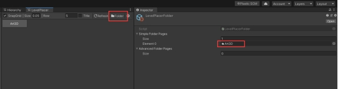
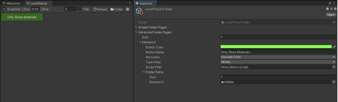
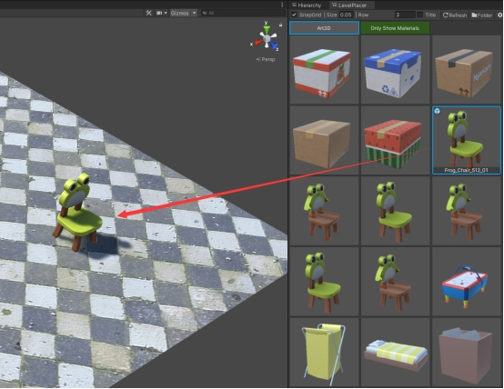
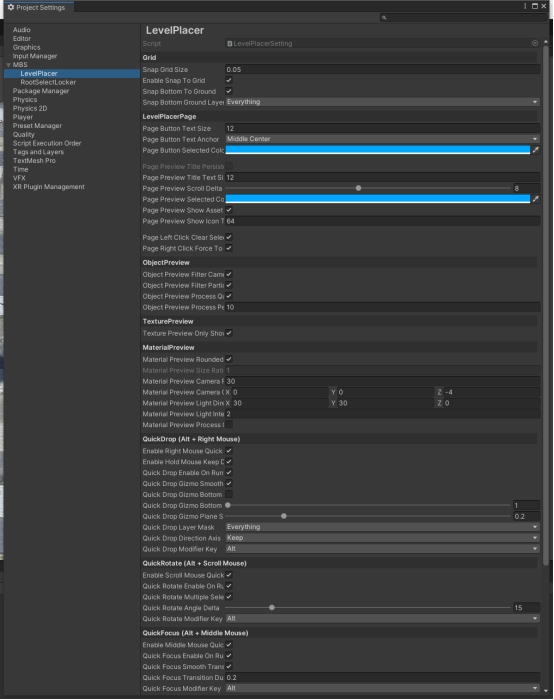

# Quick Drag & Drop | Level Placer

Quick-start manual

This is a short manual that helps you to get started with **Quick Drag & Drop | Level Placer**. 

If you have any bug reports or suggestions - [FcsVorfeed@mbs-studio.com](mailto:FcsVorfeed@mbs-studio.com)

Resource Store Connection - https://assetstore.unity.com/packages/slug/351352

# **Open LevelPlacer Window**

1. Currently, two types of windows are available. One is the Internal class window that can be fixed on the editor interface. This type of window cannot be moved quickly or closed using the shortcut key (ESC), and is suitable for users who prefer to keep the window permanently on the editor interface.

​        Operation method: 

​        Tools -> LEVELP LACER -> Open Internal Window**

​         

2. The second type is a more convenient floating window. The main difference from Internal is that the Floating window can be quickly moved by holding down the middle mouse button, and it can be closed quickly using the **ESC** key on the keyboard. This greatly facilitates the placement operation of objects when editing the level scene in the full-screen Scene window display mode. (It is highly recommended to use LevelPlacer in this way. After getting used to it, you will be able to feel a significant improvement in the efficiency of level design.)

​        Operation method: 

​        Keyboard shortcut : Ctrl + ~**

​         

# **Add Folder**

You have two ways to add folders

1. Simply drag the folder onto the LevelPlacer window, and it will be automatically added to the **Simple Folder Pages list**. By default, it will attempt to display the **Prefabs**, **Textures**, and **Materials** within that folder.

​         

2. Or, click the "Folder" button in the upper right corner of the LevelPlacer window. At this point, the folder configuration interface will be opened, allowing you to configure the folders that need to be displayed.

​         

3. You can also fully customize the content displayed in the folders in the **Advanced Folder Pages list. (Supports displaying the contents of multiple folders on a single page)**

​         

# **Place Assets**

1. All you need to do is **hold down the left mouse button** on the thumbnail of the target asset and drag it directly into the Scene to place it.
2. By holding down **Ctrl + scrolling** the mouse wheel on the LevelPlacer window, you can quickly resize the icons.

​         

# **Optimized shortcut operation**

After selecting the objects in the Scene, hold down the **Ctrl** key on the keyboard to activate the shortcut key operations.

1. **Ctrl + mouse right button**: Quickly move the selected object to the current mouse position

2. **Ctrl + mouse middle button**: Quickly focus on the position of the selected object

3. **Ctrl + mouse scroll wheel**: Quickly rotate the selected object (Y-axis in world space)

4. **Shift + mouse scroll wheel**: Quickly scale the selected object

5. **ESC**: Cancel current selection

All of the above operations support **multiple selections**.

# **Settings Interface**

You can find the detailed settings page by going to 

**Edit -> ProjectSettings -> MBS -> LevelPlacer.**

 

# **Important Notes:**

**1. Regarding File Updates:** When LevelPlacer displays assets, it reloads the corresponding Prefab data to ensure accuracy (similar to Unity's "refresh on project open"). This may occasionally cause files on disk to be marked as updated. This is *normal behavior*—usually happening when a script has added new serialized fields that the Prefab hasn't cached yet. The reload simply forces Unity to patch this data.

 

**2. Performance:** LevelPlacer uses an asynchronous pipeline to keep things smooth. However, please note that browsing folders containing *thousands of assets* may still introduce a slight momentary hitch when refreshing or switching pages.

 

**3. Memory Usage:** LevelPlacer caches asset thumbnails to allow instant page switching without reloading. While efficient, this consumes RAM. Generally, 32GB of RAM is sufficient for most use cases. However, for massive projects (e.g., >300GB), previewing thousands of assets simultaneously can increase memory load.

**Note:** In our tests with a 300GB+ project, previewing thousands of assets simultaneously consumed approximately 3GB of memory. If you encounter abnormal, prolonged freezing while browsing large collections, it is likely due to insufficient memory.

 

**4. Setup:** In most cases, *no manual configuration is required*. Default settings are tuned for efficiency based on nearly a decade of production use. If you need to adjust anything to fit your specific workflow, you can do so in the Settings window.

Feedback is always welcome—feel free to drop us an email anytime. Enjoy using LevelPlacer!