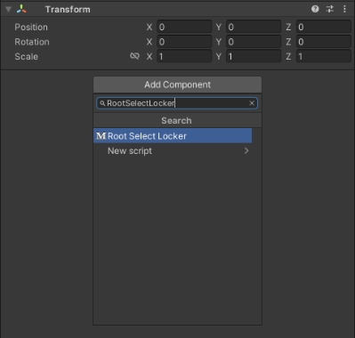
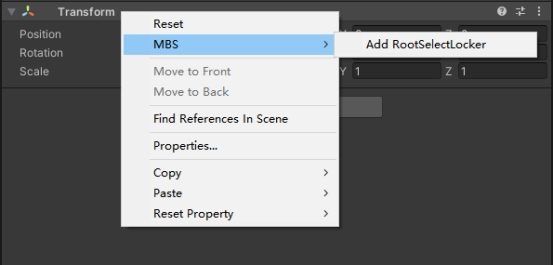
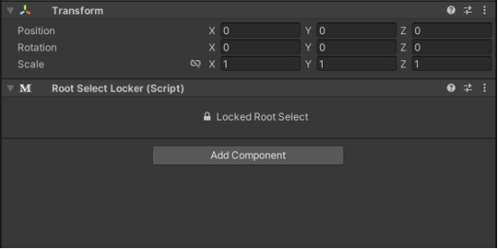
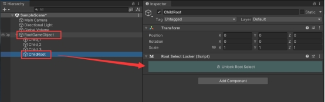
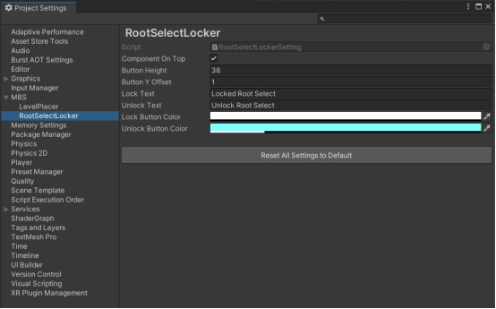

# Root Select Locker | Faster Hierarchy Workflow

Quick-start manual

This is a short manual that helps you to get started with Root Select Locker. 

If you have any bug reports or suggestions - [FcsVorfeed@mbs-studio.com](mailto:FcsVorfeed@mbs-studio.com)

Resource Store Connection - https://assetstore.unity.com/packages/slug/351036

# **Add [RootSelectLocker] Compoment to GameObject**

1. Select the GameObject node you want to lock, click the "***\*Add Component\****" button on the Inspector interface, enter "RootSelectLocker" and then choose the script to add.

 

2. Alternatively, you can also right-click on the script title bar of any Inspector and then select ***\*MBS -> Add RootSelectLocker\****

 

3. This is all the operation. From now on, if you try to select the ***\*child objects\**** of this GameObject, the system will ***\*automatically force the selection\**** to be the object that has the RootSelectLocker component added at the ***\*top level.\****

 

4. Similarly, you can also use RootSelectLocker in a ***\*nested\**** manner.

 In this case, the ***\*top-level RootSelectLocker\**** object will be automatically selected.

 

# **Settings Interface**

You can find the detailed settings page by going to 

***\*Edit -> ProjectSettings -> MBS -> RootSelectLocker.\****

 

# **Important Notes:**

The activation of RootSelectLocker is ***\*globally effective\****, which means that if you perform the switch on any object that contains the RootSelectLocker component, all other objects with this component will also be updated simultaneously. Therefore, you don't need to worry about each object; you just need to follow your instincts when operating.`

 

Secondly, the activation of RootSelectLocker will ***\*not cause any changes to the serialization\**** of Prefabs. Therefore, you can operate at any time without any concerns, as this will not affect the saved state of any Prefabs.

 

Finally, RootSelectLocker will ***\*automatically reset\**** every time the ***\*game's play state changes\****. This ensures that you won't accidentally operate the sub-objects due to forgetting to switch the switch state when repeatedly exiting the debugging scene. All of this is a user-friendly configuration derived from years of practice in multiple projects. You can rest assured to use it.

 