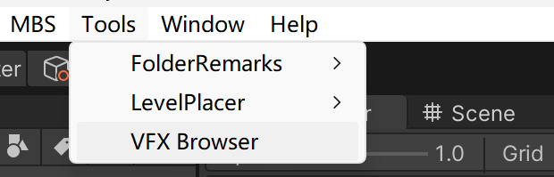
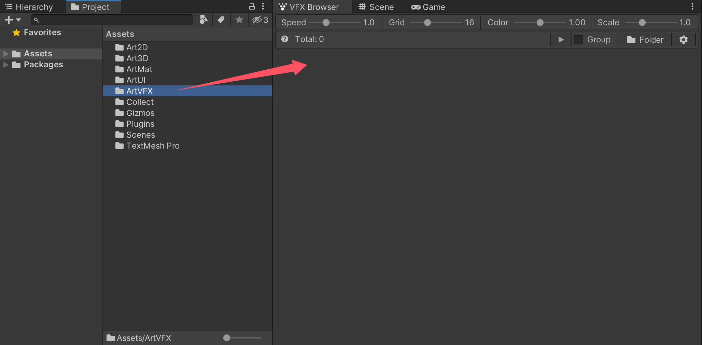
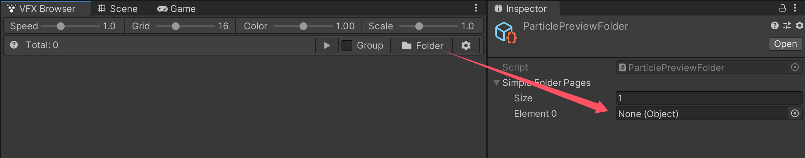
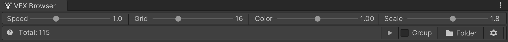
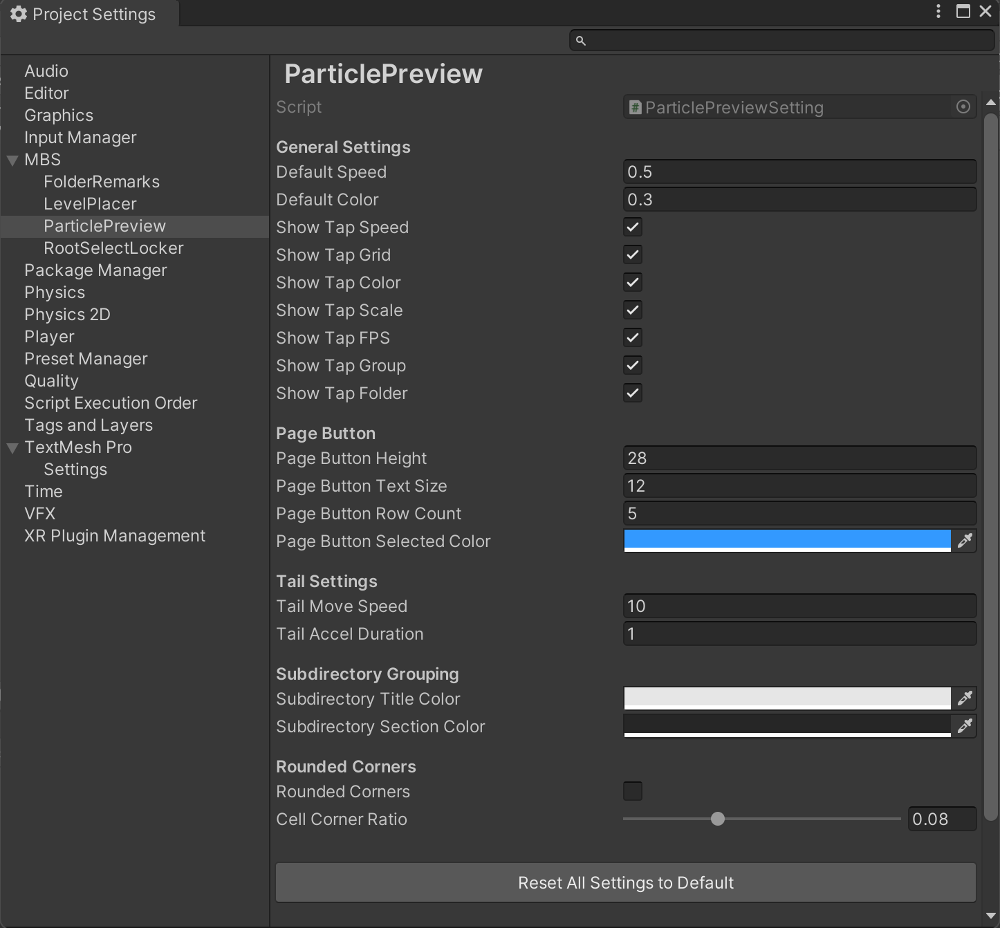

# Dynamic Particle Preview | VFX Browser

Quick-start manual

This is a short manual that helps you to get started with **Dynamic Particle Preview | VFX Browser**. 

If you have any bug reports or suggestions - [FcsVorfeed@mbs-studio.com](mailto:FcsVorfeed@mbs-studio.com)

Resource Store Connection - https://assetstore.unity.com/packages/slug/355556

# **Open VFX Browser Window**

​	**Tools -> VFX Browser**

​	

# **Add Folder**

1. Simply drag the folder onto the VFX Browser window, and it will be automatically added to the **Simple Folder Pages list**. By default, it will attempt to display the **Particle System** and **VFX Graphs** within that folder.

2. Or, click the "Folder" button in the right corner of the VFX Browser window. At this point, the folder configuration interface will be opened, allowing you to configure the folders that need to be displayed.

 

# **Place Assets**

All you need to do is **hold down the left button** on the thumbnail and drag it directly into the Scene to place it.

 

# **Optimized shortcut operation**

- **Left-Click:** Replay particle
- **Left-Hold:** Stop movement
- **Right-Click:** Select asset
- **Right-Drag:** Rotate camera
- **Middle-Drag:** Pan effect
- **HoldCtrl + Scroll Wheel:** Zoom in / out
- **HoldRight + Scroll Wheel:** Zoom in / out

# Quick Setting

You can quickly configure common preview settings directly in the top Title Bar.

Also you can click the label to the left of any slider to instantly **reset** it to its default value.

- **Speed**: Adjust the playback rate for all particle effects simultaneously.
- **Grid**: Control the number of previews displayed on screen at once.
- **Color**: Adjust the preview background brightness or shade.
- **Scale**: Scale the preview size for all effects.
- **Group**: Toggle whether to categorize and display effects based on subdirectories.

# **Settings Interface**

You can find the detailed settings page by going to 

**Edit -> ProjectSettings -> MBS -> ParticlePreview.**

 

# **Important Notes:**

- **Performance:** While the plugin is heavily optimized internally, particle effects are inherently resource-intensive assets. Since this tool provides **real-time previews** for multiple dynamic effects simultaneously, actual performance depends primarily on VFX complexity and hardware specifications. If performance issues occur, reduce the **Grid Count** to limit the number of simultaneous previews on screen.

- **Runtime Preview:** 
  The VFX Browser supports full functionality—including previewing and dragging assets into the scene—during **Play Mode**.

  However, testing has shown that certain Asset Store VFX may trigger Error Logs during runtime preview due to non-standard scripting practices within those specific assets. If errors occur, first investigate whether the issue is isolated to particular assets.

  The VFX Browser's primary interaction with an effect is attempting to access its **Animator** for playback, which should not cause issues in standard setups. If the plugin conflicts with your project's specific script implementations, please report the issue via **email**.

 

Feedback is always welcome—feel free to drop us an email anytime. Enjoy using VFX Browser!