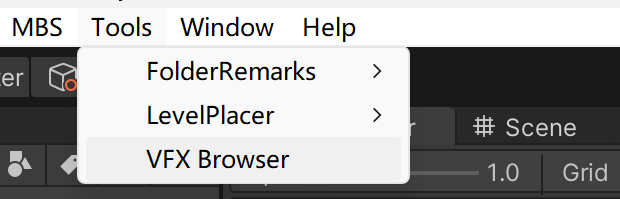
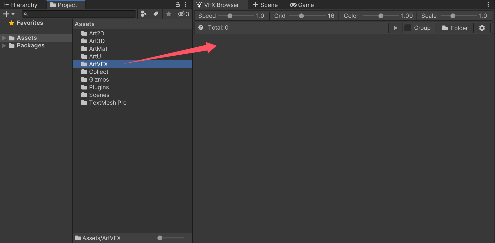
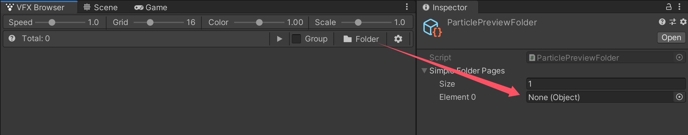
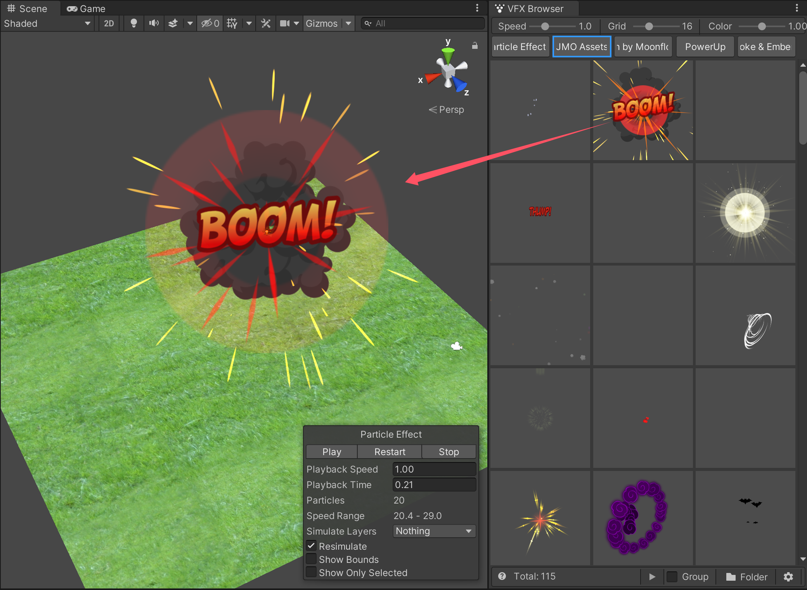
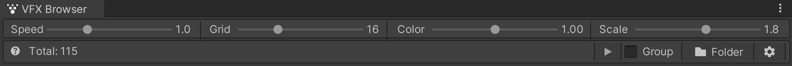
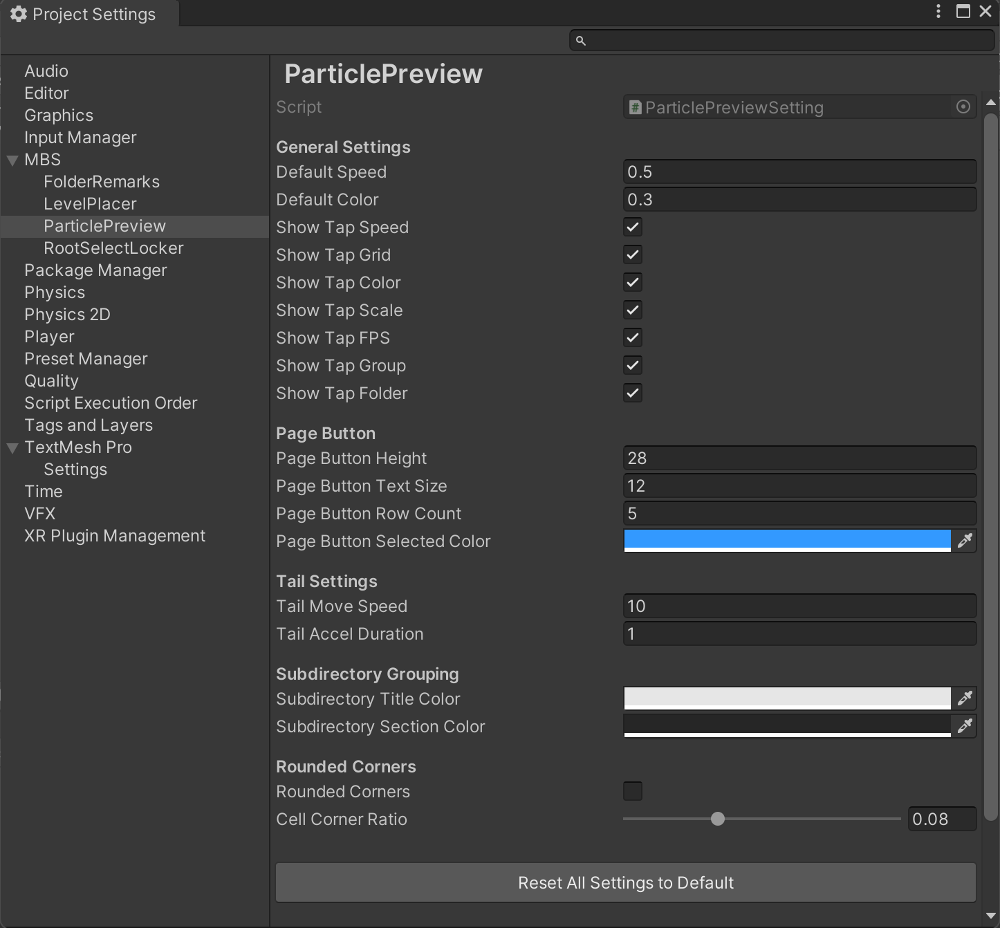

# Dynamic Particle Preview | VFX Browser

Quick-start manual

This is a short manual that helps you to get started with **Dynamic Particle Preview | VFX Browser**. 

If you have any bug reports or suggestions - [FcsVorfeed@mbs-studio.com](mailto:FcsVorfeed@mbs-studio.com)

Resource Store Connection - https://assetstore.unity.com/packages/slug/355556

# **Open VFX Browser Window**

​	**Tools -> VFX Browser**

​	

# **Add Folder**

1. Simply drag the folder onto the VFX Browser window, and it will be automatically added to the **Simple Folder Pages list**. By default, it will attempt to display the **Particle System** and **VFX Graphs** within that folder.

2. Or, click the "Folder" button in the right corner of the VFX Browser window. At this point, the folder configuration interface will be opened, allowing you to configure the folders that need to be displayed.

 

# **Place Assets**

All you need to do is **hold down the left button** on the thumbnail and drag it directly into the Scene to place it.

 

# **Optimized shortcut operation**

- **Left-Click:** Replay particle
- **Left-Hold:** Stop movement
- **Right-Click:** Select asset
- **Right-Drag:** Rotate camera
- **Middle-Drag:** Pan effect
- **HoldCtrl + Scroll Wheel:** Zoom in / out
- **HoldRight + Scroll Wheel:** Zoom in / out

# Quick Setting

You can quickly configure common preview settings directly in the top Title Bar.

Also you can click the label to the left of any slider to instantly **reset** it to its default value.

- **Speed**: Adjust the playback rate for all particle effects simultaneously.
- **Grid**: Control the number of previews displayed on screen at once.
- **Color**: Adjust the preview background brightness or shade.
- **Scale**: Scale the preview size for all effects.
- **Group**: Toggle whether to categorize and display effects based on subdirectories.

# **Settings Interface**

You can find the detailed settings page by going to 

**Edit -> ProjectSettings -> MBS -> ParticlePreview.**

 

# **Important Notes:**

- **Performance:** While the plugin is heavily optimized internally, particle effects are inherently resource-intensive assets. Since this tool provides **real-time previews** for multiple dynamic effects simultaneously, actual performance depends primarily on VFX complexity and hardware specifications. If performance issues occur, reduce the **Grid Count** to limit the number of simultaneous previews on screen.

- **Runtime Preview:** 
  The VFX Browser supports full functionality—including previewing and dragging assets into the scene—during **Play Mode**.

  However, testing has shown that certain Asset Store VFX may trigger Error Logs during runtime preview due to non-standard scripting practices within those specific assets. If errors occur, first investigate whether the issue is isolated to particular assets.

  The VFX Browser's primary interaction with an effect is attempting to access its **Animator** for playback, which should not cause issues in standard setups. If the plugin conflicts with your project's specific script implementations, please report the issue via **email**.

 

Feedback is always welcome—feel free to drop us an email anytime. Enjoy using VFX Browser!

------

# 日本語マニュアル (Japanese Manual)

# Dynamic Particle Preview | VFX Browser

クイックスタートマニュアル

本マニュアルは、**Dynamic Particle Preview | VFX Browser** を使い始めるための簡単なガイドです。

バグ報告やご提案がございましたら、こちらまでご連絡ください：[FcsVorfeed@mbs-studio.com](mailto:FcsVorfeed@mbs-studio.com)

アセットストアリンク：https://assetstore.unity.com/packages/slug/355556

# **VFX Browser ウィンドウを開く**

​	**Tools -> VFX Browser**

​	

# **フォルダの追加**

- フォルダを VFX Browser ウィンドウにドラッグするだけで、自動的に **Simple Folder Pages リスト** に追加されます。デフォルトでは、そのフォルダ内の **Particle System** および **VFX Graph** を表示しようとします。

- または、VFX Browser ウィンドウの右隅にある「Folder」ボタンをクリックします。するとフォルダ設定インターフェースが開き、表示するフォルダを設定できます。

# **アセットの配置**

サムネイル上で**左ボタンを押したまま**、直接 Scene（シーン）にドラッグするだけで配置できます。

# **最適化されたショートカット操作**

- **左クリック:** パーティクルの再再生
- **左ボタン長押し:** 動きの停止
- **右クリック:** アセットの選択
- **右ドラッグ:** カメラの回転
- **中ドラッグ:** エフェクトのパン（平行移動）
- **Ctrlキー + マウスホイール:** ズームイン / ズームアウト
- **右ボタン + マウスホイール:** ズームイン / ズームアウト

# クイック設定

上部のタイトルバーから、一般的なプレビュー設定をすばやく行うことができます。

また、スライダーの左側にあるラベルをクリックすると、即座にデフォルト値に**リセット**されます。

- **Speed（速度）**: すべてのパーティクルエフェクトの再生速度を同時に調整します。
- **Grid（グリッド）**: 画面上に同時に表示されるプレビューの数を制御します。
- **Color（カラー）**: プレビュー背景の明るさや色合いを調整します。
- **Scale（スケール）**: すべてのエフェクトのプレビューサイズを拡大縮小します。
- **Group（グループ）**: サブディレクトリに基づいてエフェクトを分類し表示するかどうかを切り替えます。

# **設定インターフェース**

詳細な設定ページは、以下の場所にあります。

**Edit -> ProjectSettings -> MBS -> ParticlePreview.**

# **重要な注意事項：**

- **パフォーマンス:** プラグイン内部では高度な最適化が行われていますが、パーティクルエフェクトは本質的にリソースを大量に消費するアセットです。本ツールは複数の動的エフェクトの**リアルタイムプレビュー**を同時に提供するため、実際のパフォーマンスは主に VFX の複雑さとハードウェアのスペックに依存します。パフォーマンスの問題が発生した場合は、**Grid Count（グリッド数）** を減らして、画面上に同時に表示されるプレビューの数を制限してください。

- **ランタイムプレビュー:** VFX Browser は、**Play Mode（プレイモード）** 中でも、プレビューや Scene へのアセットのドラッグなど、すべての機能をサポートしています。

  ただし、テストの結果、アセットストアの一部の VFX では、特定のアセット内の非標準的なスクリプト実装により、ランタイムプレビュー中にエラーログがトリガーされる可能性があることが判明しています。エラーが発生した場合は、まず問題が特定のアセットに限定されているかどうかをご確認ください。

  VFX Browser がエフェクトと相互作用する主な処理は、再生のために **Animator** にアクセスすることであり、標準的なセットアップでは問題を引き起こすことはありません。プラグインがプロジェクト内の特定のスクリプト実装と競合する場合は、**メール**にてご報告をお願いいたします。

  

フィードバックはいつでも歓迎しております。いつでもお気軽にメールでお問い合わせください。VFX Browser をお楽しみください！